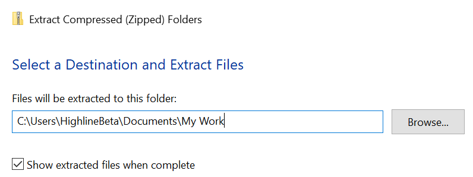

# NewsAggregator

## Internal tool for Highline Beta - Finance Hub

### Steps to Run the News Aggregator App Locally

### First Time

#### 1. **Install Python**

- Go to the [Python Downloads Page](https://www.python.org/downloads/).
- Download the version suitable for your computer (Windows/Mac/Linux).
- During installation:
  - **On Windows**: Check the box that says **Add Python to PATH** before clicking "Install Now".
  - Follow the prompts to complete the installation.
- Once you have python installed, you shouldn't have to install again unless requiring a newer version.

### For new changes to the app (for now)

#### 2. **Download the Project**

- Open your browser and visit the GitHub link I provided for the project.
- Click the green **Code** button and select **Download ZIP**.
- Once the download finishes, extract the ZIP file to a folder on your computer.
- Copy the path where your extracted folder is (for step 4) 

#### 3. **Open a Terminal or Command Prompt**

- **On Windows**: Press `Win + R`, type `cmd`, and press Enter.
- **On Mac/Linux**: Open the Terminal from your Applications menu.

#### 4. **Navigate to the Project Folder**

- In the terminal, use the `cd` command to go to the folder where you extracted the ZIP file.
  - Example: If you extracted it to `C:\Users\HighlineBeta\Downloads\NewsAggregator-main`, type:
    ```bash
    cd C:/Users/HighlineBeta/Downloads/NewsAggregator-main
    ```

#### 5. **Create a Virtual Environment**

- Run this command to create a virtual environment:
  ```bash
  python -m venv venv
  ```
- This will create a folder named `venv` in the project directory.
- **NOTE**: If you already have a folder (named `venv`) or else dedicated to the virtual environment, please delete the folder after new downloads (in step 3). You will need to run this command succesfully to continue.

#### 6. **Activate the Virtual Environment**

- **On Windows**:
  ```bash
  venv\Scripts\activate
  ```
- **On Mac/Linux**:
  ```bash
  source venv/bin/activate
  ```

#### 7. **Install Dependencies**

- Run this command to install the necessary Python packages:
  ```bash
  pip install -r requirements.txt
  ```

#### 8. **Run the Flask App**

- Start the Flask app with this command:
  ```bash
  python run.py
  ```
- You will see a message like:
  ```
  Running on http://127.0.0.1:5000/ (Press CTRL+C to quit)
  ```

#### 9. **View the App in Your Browser**

- Open your browser and type the following address:
  ```
  http://127.0.0.1:5000/
  ```
- You should now see the app running.

#### 10. **Shut Down the App**

- When you're done viewing the app, return to the terminal and press `CTRL+C` to stop it.
- To exit the virtual environment, type:
  ```bash
  deactivate
  ```

---

### Alternate Approach: Hosting the App

For a demo that doesn't require users to set up a local environment, you can host the app on a free or low-effort platform. Here are some options:

1. **GitHub Pages (Static Sites Only)**:

   - If your Flask app doesn’t require server-side interactivity, consider converting it to a static site (e.g., using Flask-Frozen) and hosting on GitHub Pages.

2. **Glitch or Replit**:

   - Platforms like [Replit](https://replit.com/) or [Glitch](https://glitch.com/) allow you to run Python-based web apps with zero local setup.
   - Upload your project, and they'll provide a live link.

3. **Render or Heroku**:
   - [Render](https://render.com/) or [Heroku](https://www.heroku.com/) offer free tiers for hosting small apps.
   - This is slightly more complex but results in a live site you can share with others.

---

### Recommendation

For a non-technical audience, providing a **live-hosted demo** is the most foolproof option. If that’s not feasible, ensure the instructions above are tailored to their operating system and include screenshots or a video tutorial to make the process easier.
