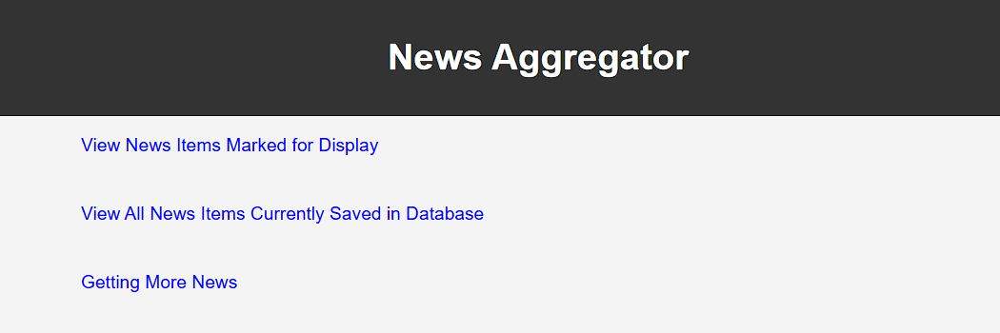
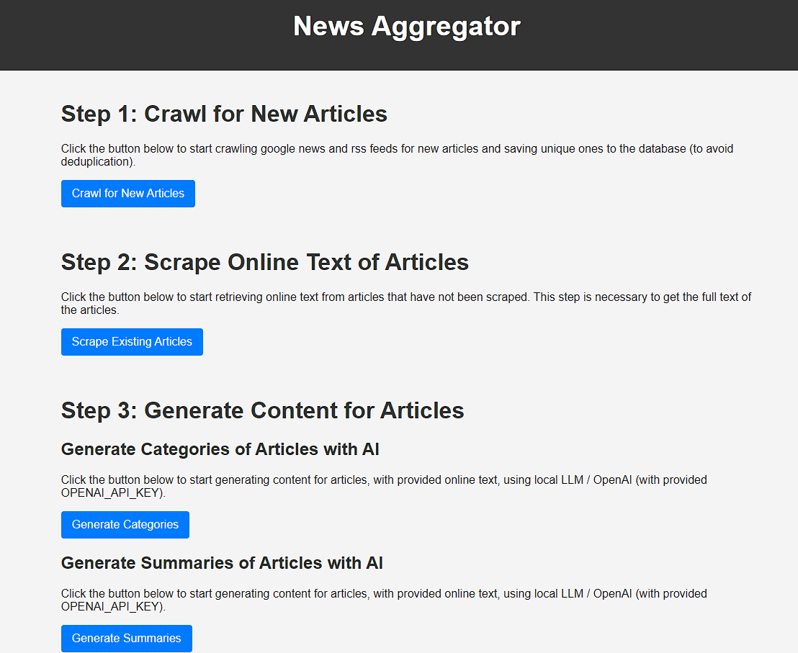

# NewsAggregator

## Running the App Locally

### Prerequisites

- Python 3.12 installed on your system (Windows/Mac/Linux)
  - Go to the [Python Downloads Page](https://www.python.org/downloads/release/python-31210/).
  - During installation:
    - **On Windows**: Check the box that says **Add Python to PATH** before clicking "Install Now".
  - Follow the prompts to complete the installation.
    - `pip` package manager [should be installed](https://pip.pypa.io/en/stable/installation/)
- [Supabase](https://supabase.com/dashboard/sign-up) account to access project's database, for associated organization
  - [This is where you retrieve two environment variables required](https://supabase.com/docs/guides/api#api-url-and-keys):
    - `SUPABASE_URL` = your_supabase_url
    - `SUPABASE_KEY` = your_supabase_key
- Access to an LLM
  - This can be either through a local LLM, such as using downloaded LLMs through [Ollama](https://ollama.com/)
    - If using this option, set the following environment variable:
      - `LLM_ENDPOINT`= [your_llm_end_point](https://arshsharma.com/posts/2024-07-10-openai-ollama-dev/)
  - But probably the easier option is to use OpenAI's integration with their LLMs, accessible through an `OPENAI_API_KEY`, requiring account, and billing & payment set up
    - If using this option, set the following environment variables:
    - `OPENAI_API_KEY` = [your_openai_api_key](https://help.openai.com/en/articles/4936850-where-do-i-find-my-openai-api-key)
    - `OPENAI_ORGANIZATION` = [your_openai_account_organization_id](https://platform.openai.com/docs/api-reference/authentication#:~:text=If%20you%20belong,2%0A3%0A4)
    - `OPENAI_PROJECT` = [your_openai_project_id](https://platform.openai.com/docs/api-reference/authentication#:~:text=If%20you%20belong,2%0A3%0A4)

### Steps to Run the App

1. **Clone/Download the Project**  
   You can either:

   - **Clone the Repository**  
     Clone this repository to your local machine, having Git installed:
     ```bash
     git clone <repository-url>
     ```
   - **Download as ZIP**  
     If you don't have Git installed, download the repository as a ZIP file:

     - Go to the GitHub repository page.
     - Click the green "Code" button and select "Download ZIP".
     - Once the download is finished, extract the ZIP file to a folder and keep track of the folder path on your system. 

2. **Open a Terminal or Command Prompt**

   - **On Windows**: Press `Win + R`, type `cmd`, and press Enter.
   - **On Mac/Linux**: Open the Terminal from your Applications menu.

3. **Navigate to the Project Folder**

   In the terminal, use the `cd` command to change the directory of the working terminal to the folder where you extracted the ZIP file.

   ```bash
   cd extracted/folder/path
   ```

   Example: If you extracted it to `C:\Users\HighlineBeta\Documents\My Work`, type:

   ```bash
   cd "C:/Users/HighlineBeta/Documents/My Work"
   ```

4. **Create and activate a Virtual Environment**  
   First, create the virtual environment:

   ```bash
   python -m venv .venv
   ```

   This will create a folder named `.venv` in the project directory.

   Then activate it.

   **On Mac**

   ```bash
   source .venv/bin/activate
   ```

   **On Windows**:

   ```bash
   .venv/Scripts/activate
   ```

5. **Install Dependencies**  
   Install the required dependencies from `requirements.txt`:

   ```bash
   pip install -r requirements.txt
   ```

6. **Set Up Environment Variables**  
    Create a `.env` file in the root directory and add the necessary environment variables.

   Required, assuming access to LLM is through OpenAI

   ```
   SUPABASE_URL=your_supabase_url
   SUPABASE_KEY=your_supabase_key
   OPENAI_API_KEY=your_openai_api_key
   OPENAI_ORGANIZATION=your_openai_account_organization_id
   OPENAI_PROJECT=your_openai_project_id
   ```

   Optional

   ```
   LLM_ENDPOINT=your_llm_endpoint
   ```

7. **Run the Application**  
   Start the Flask application:

   ```bash
   python run.py
   ```

   The app will be accessible at `http://localhost:5000`.

8. **Shut Down the App**

   When you're done running the app, return to the terminal and press `CTRL+C` to stop it.
   To exit the virtual environment, type:

   ```bash
   deactivate
   ```

## Technical Architecture

### 1. Find All the News and Capture It

#### Data Source Integrations

- **Google RSS Feeds**: Using `pygooglenews` to parse search queries [which are found here](src/services/crawlers/google_news_crawl.py).
- **Specific RSS Feeds**: Using `feedparser` to parse RSS feeds provided by the team or found online [which are found here](src/services/crawlers/rss_feed_crawl.py).

#### Content Parsing and Extraction

News articles are parsed and standardized into a `NewsItemSchema` model using Pydantic.

- This was done as news from multiple data sources need to be standardized in one format
- The required fields for each NewsItem to add to the database are:
  - `data_source_type`: Type of data source from the following list ("Specific RSS Feed", "Google News RSS Feed", "Website")
  - `data_json`: JSON data of the crawled news "article"
  - `data_URL`: URL of the crawled news "article"
- Other fields are either derived from the JSON data or generated by the AI components of the app

#### Storage

- News items are stored in a Supabase database using the `SupabaseDBService`.

---

### 2. Present News to Human Editor

#### Viewing News

- A Flask app is used to display news items in the browser.
- Routes are defined in `routes.py`

Current Homepage


Getting More News


#### Summaries and Categorization

- Article text is extracted using the `crawl4ai` package.
  - As of April 4, 2025, crawl4ai is a top contender for easily and efficiently scraping text from webpages to pass to LLMs. [The package has a bug which I reported, and is being worked on.](https://github.com/unclecode/crawl4ai/issues/920#issuecomment-2779688104) I found a patch for this bug and added it to the scraper.
- Article text is used to pass as input to LLMs, to generate summaries and assign categories.

#### Categories

The following categories are used for classification:

- Government Policy & Regulatory Updates
- Financial Incentives & Housing Programs
- Industry Innovations & Construction Resources
- Community Initiatives & Local Developments
- Housing Market Trends & Demographic Insights

---

### 3. Publish News to Webflow Site

#### Exporting Data

- News items can be marked for display and exported as a CSV for integration with Webflow CMS.
